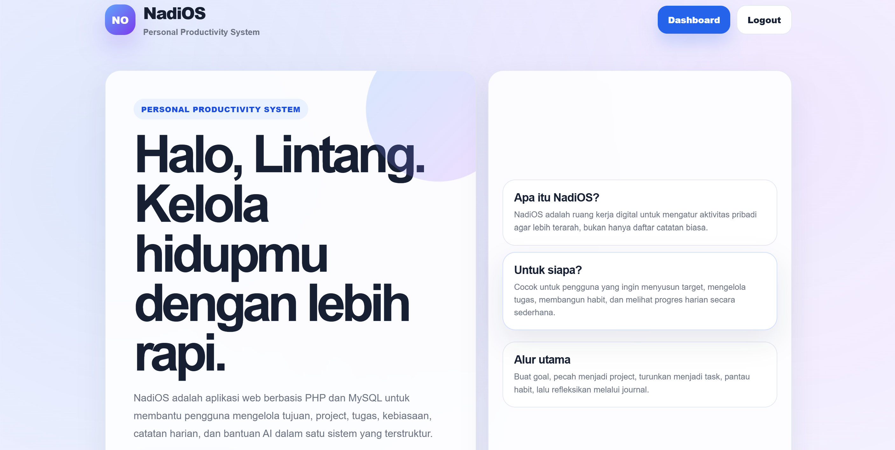
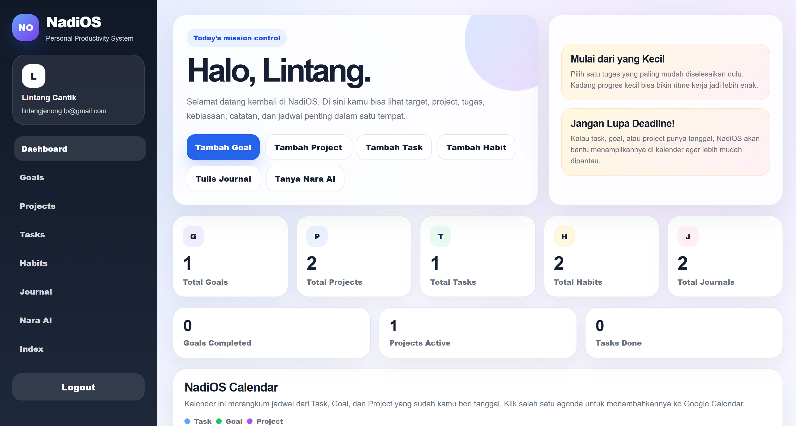
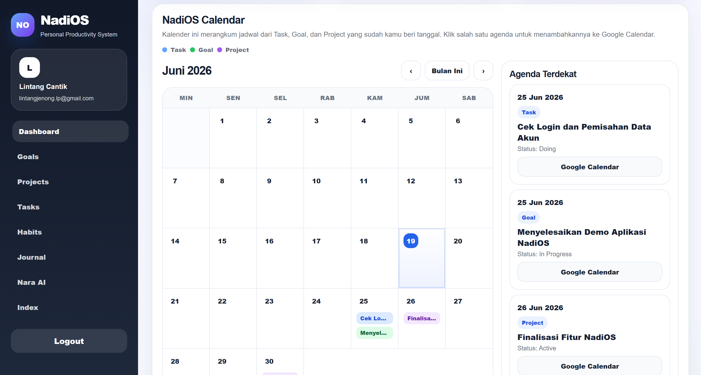

# NadiOS — Personal Productivity System

NadiOS adalah aplikasi web berbasis **PHP Native** dan **MySQL** yang membantu pengguna mengelola produktivitas pribadi dalam satu ruang. Aplikasi ini menyediakan fitur untuk mencatat tujuan, mengelola project, menyusun task, membangun habit, menulis journal, serta menggunakan bantuan **Nara AI** untuk rekomendasi prioritas dan refleksi harian.

## Studi Kasus

Banyak pengguna kesulitan mengelola aktivitas pribadi karena goal, project, task, kebiasaan, dan catatan harian sering tersebar di tempat berbeda. NadiOS dibuat untuk menyatukan seluruh proses tersebut agar pengguna dapat merencanakan, menjalankan, memantau, dan mengevaluasi produktivitas hariannya secara lebih terstruktur.

## Fitur Utama


- **Register dan Login** menggunakan akun lokal.
- **Login dengan Google** menggunakan OAuth.
- **Dashboard** untuk melihat ringkasan goal, project, task, habit, journal, dan agenda.
- **Goals** untuk membuat, membaca, mengubah, menghapus, dan menambahkan gambar pada tujuan.
- **Projects** untuk mengelola project, status, deadline, serta lampiran file.
- **Tasks** untuk mengelola task, prioritas, status, deadline, relasi project, dan lampiran file.
- **Habits** untuk mencatat kebiasaan dan menandai habit harian.
- **Journals** untuk menulis refleksi, memilih mood, dan mengunggah gambar pendukung.
- **Nara AI** sebagai asisten produktivitas dan teman refleksi.
- **User Data Scope** agar data setiap user tidak bercampur dengan user lain.
- **Pure CSS Responsive UI** tanpa framework CSS tambahan.

## Teknologi yang Digunakan

- PHP Native
- MySQL / MariaDB
- HTML
- Pure CSS
- JavaScript
- Google OAuth
- Gemini API / OpenAI API untuk Nara AI
- XAMPP untuk pengembangan lokal

## Struktur Database

Database utama menggunakan MySQL dengan tabel berikut:

| Tabel | Fungsi |
|---|---|
| `users` | Menyimpan data akun pengguna. |
| `goals` | Menyimpan data tujuan pengguna. |
| `projects` | Menyimpan data project pengguna. |
| `tasks` | Menyimpan data task dan relasi ke project. |
| `habits` | Menyimpan daftar kebiasaan pengguna. |
| `habit_logs` | Menyimpan riwayat habit yang dicentang per tanggal. |
| `journals` | Menyimpan catatan refleksi dan mood pengguna. |

### Relasi Utama

- `users.id` berelasi dengan `goals.user_id`.
- `users.id` berelasi dengan `projects.user_id`.
- `users.id` berelasi dengan `tasks.user_id`.
- `users.id` berelasi dengan `habits.user_id`.
- `users.id` berelasi dengan `journals.user_id`.
- `projects.id` berelasi dengan `tasks.project_id`.
- `habits.id` berelasi dengan `habit_logs.habit_id`.

## Struktur Folder

```text
NadiOS/
├── index.php
├── register.php
├── login.php
├── logout.php
├── dashboard.php
├── goals.php
├── projects.php
├── tasks.php
├── habits.php
├── journals.php
├── ai_assistant.php
├── auth_check.php
├── koneksi.php
├── google_login.php
├── google_callback.php
├── google_config.php
├── config/
│   └── ai_config.php
├── assets/
└── uploads/
    ├── goals/
    ├── projects/
    ├── tasks/
    └── journals/
```

## Cara Menjalankan di Hosting

NadiOS dapat dijalankan secara online melalui tautan hosting berikut:

```text
https://nadios.site.je/NadiOS/
```

Tautan tersebut mengarah ke aplikasi NadiOS versi web yang telah di-deploy secara publik, sehingga dapat mengakses dan mencoba fitur aplikasi tanpa menjalankannya melalui localhost.

## Akun Demo

Jika diperlukan, buat akun demo melalui halaman register aplikasi.

```text
Email: demo@nadios.local
Password: demo12345
```

Catatan: akun demo hanya contoh. Sesuaikan dengan data yang dibuat di database.

## Status Pengembangan

NadiOS telah mencakup fitur CRUD, relasi database, upload file/gambar, autentikasi user, dashboard, serta integrasi AI assistant. Aplikasi ini dikembangkan sebagai proyek Software Development Track.

## Author

Dikembangkan oleh:

```text
Lintang Angrenggani Kusuma R. - 202431083
```
